<!-- BAD-PI // RED TEAM OPERATIONS NODE -->

  

  

 

<table width="100%">
<tr>
<td width="50%" align="center">
<a href="https://github.com/QmFkLVBp/hckfetch"><b>01 // HCKFETCH</b></a> 
Operator telemetry and pentest activity tracking  

</td>
<td width="50%" align="center">
<a href="https://github.com/QmFkLVBp/SSPE"><b>02 // SSPE</b></a> 
Linux attack-surface and privilege analysis  

</td>
</tr>
<tr>
<td width="50%" align="center">
<a href="https://github.com/QmFkLVBp/decryptoinator"><b>03 // DECRYPTOINATOR</b></a> 
Cryptology and steganography workbench  

</td>
<td width="50%" align="center">
<a href="https://github.com/QmFkLVBp/MIMEXOR"><b>04 // MIMEXOR</b></a> 
Safe adversary emulation for controlled AV/EDR labs  

</td>
</tr>
</table>

<b>OPEN ASSET TELEMETRY</b>

 

  
  

  
  

 

  <code>AUTHORIZED RESEARCH ONLY // EVIDENCE OVER ASSUMPTIONS // DOCUMENT THE OPERATION</code>

